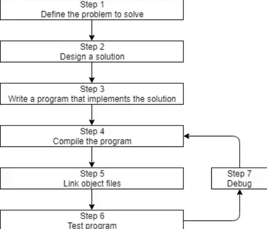
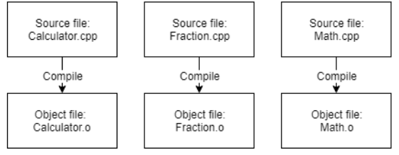
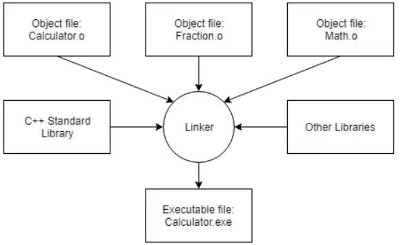

### Machine Language

A computer’s CPU is incapable of speaking C++. The limited set of instructions that a CPU can understand directly is called machine code (or machine language or an instruction set). Example: 10110000 01100001

### Assembly Language

Because machine language is so hard for humans to read and understand, assembly language was invented. In an assembly language, each instruction is identified by a short abbreviation (rather than a set of bits), and names and other numbers can be used.

### High-level Languages

To address the readability and portability concerns, new programming languages such as C, C++, Pascal (and later, languages such as Java, Javascript, and Perl) were developed. These languages are called high level languages, as they are designed to allow the programmer to write programs without having to be as concerned about what kind of computer the program will be run on.

**Compiler** 
is a program (or collection of programs) that reads source code (typically written in a high-level language) and translates it into some other language (typically a low-level language, such as assembly or machine language, etc…).

**Interpreter** 
is a program that directly executes the instructions in the source code without requiring them to be compiled into an executable first.

>*Q: What is C++ good at?*
C++ excels in situations where high performance and precise control over memory and other resources is needed
- Embedded SW
- Real-time systems
- High-performance financial applications
- Graphical applications / simulations
- AI and Neural networks

### How to develop a C++ Program

### Compiling Source Code
- Compiler checks if there is an error.
- Compiler translates your C++ code into machine language instructions. These instructions are stored in an intermediate file called an **object file** (-o). 

### Linking Object Files and 
Linker’s job is to combine all of the object files and produce the desired output file (typically an executable file), process is called linking.

## Building
Building is often used to refer to the full process of converting source code files into an executable that can be run. 
A specific executable produced as the result of building is sometimes called a build.

>**g++ on the command line**
- `g++ -o program_name program_name.cpp`